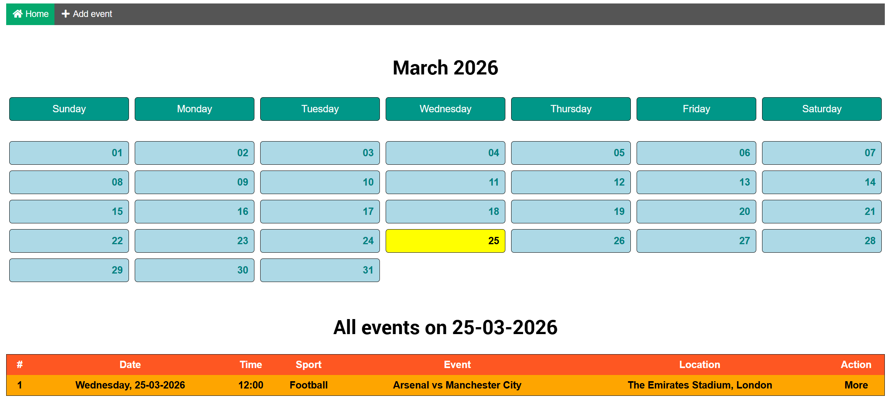
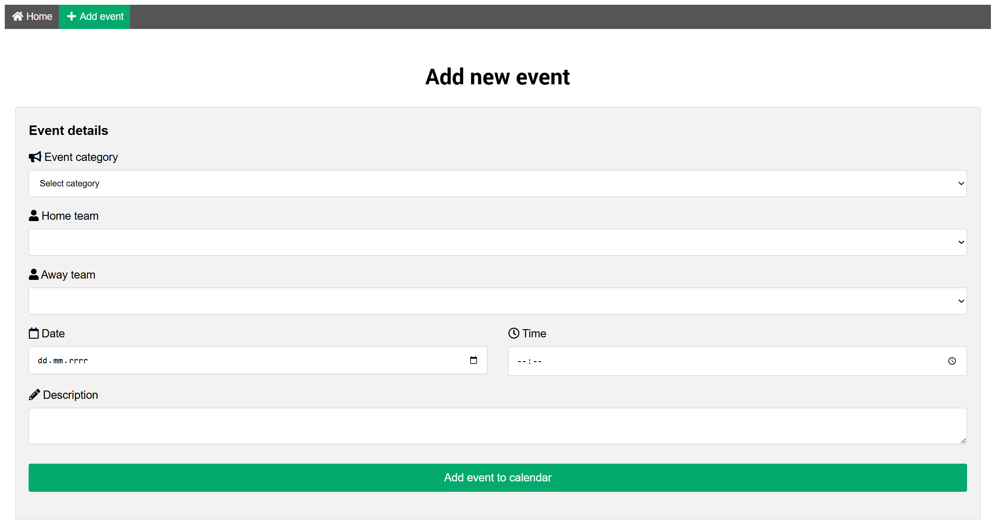
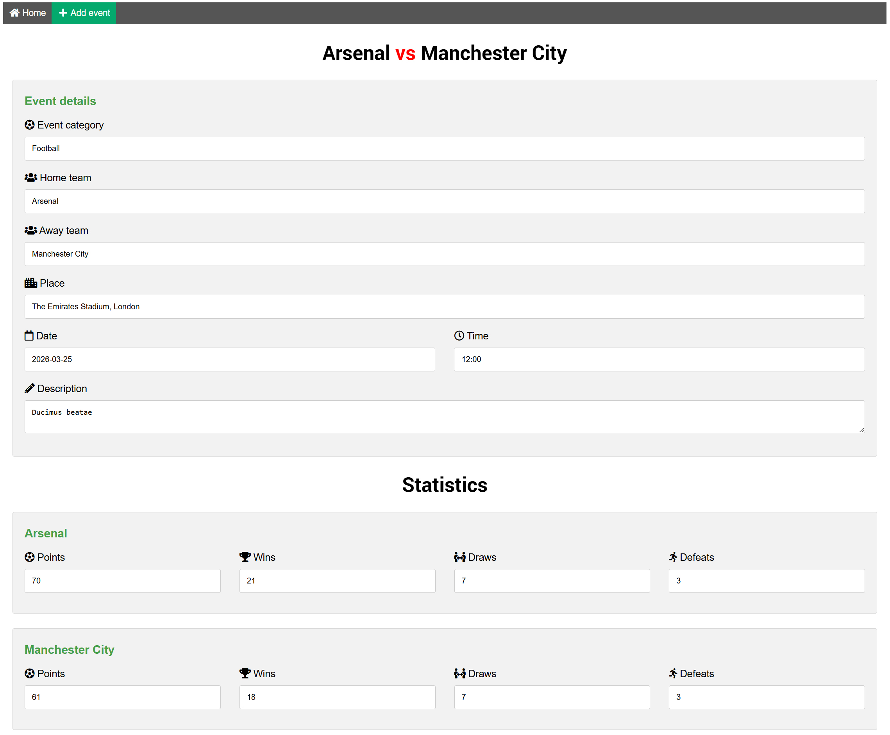

<p align="center">
    <a href="">
        
    </a>
</p>

# Sports calendar

Sports calendar is a microapp, where users can see future sports events and add new also.

## Requirements

- PHP 7.1+
- MySQL 5.7+

## Installation

1. Clone the repository and setup your .env file.

```
git clone https://github.com/grzegorz-bankowski/sports-calendar.git
```

2. Create the database based on file 'database-setup.sql'
3. Add sample data from files: categories-example-data.sql, teams-example-data.sql

## Screenshots

<p align="center">
    
    <hr style="height:1px">
    
    <hr style="height:1px">
</p>